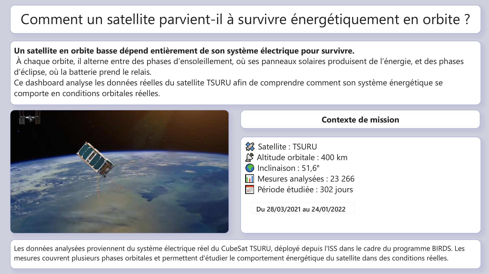
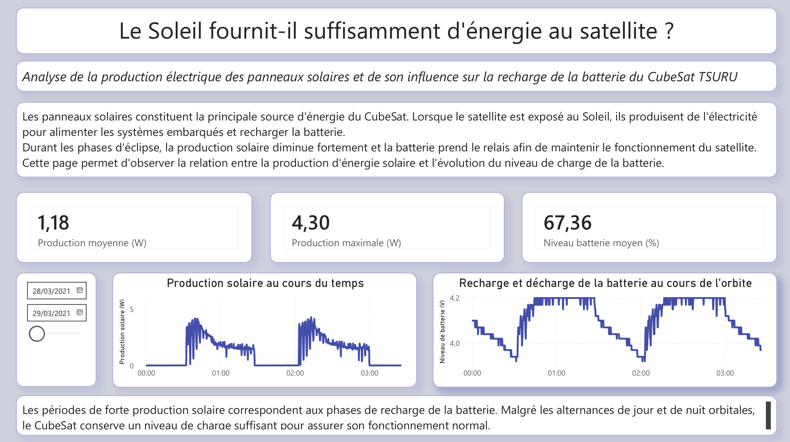
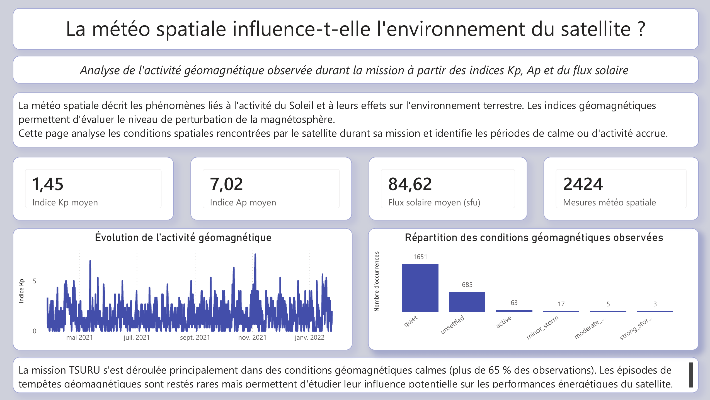
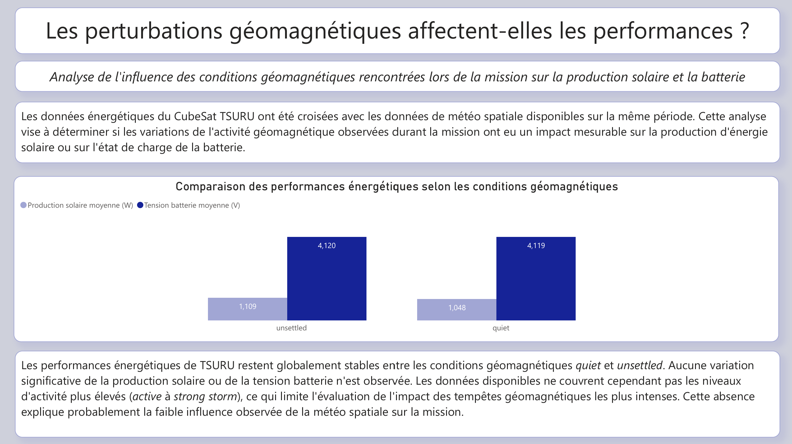
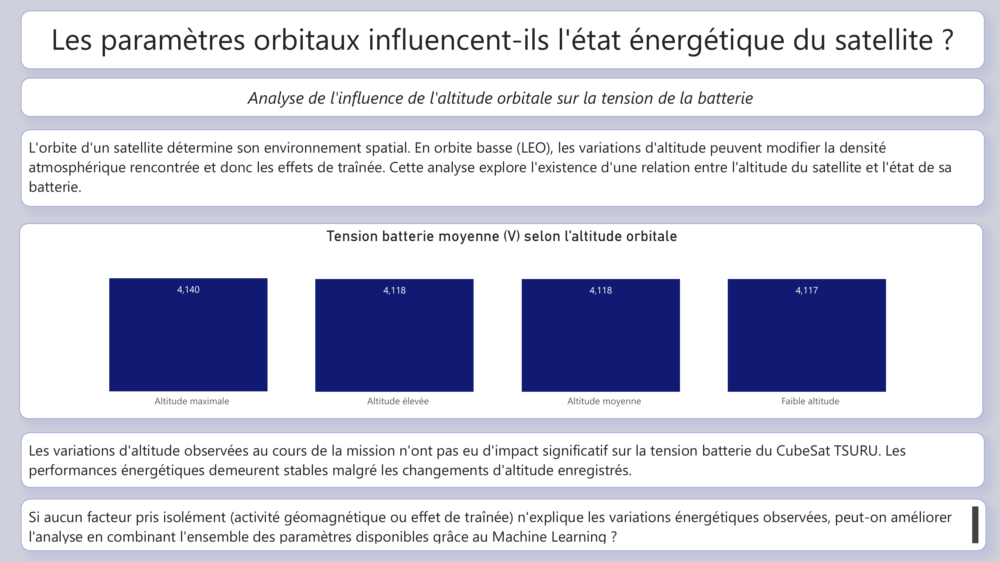
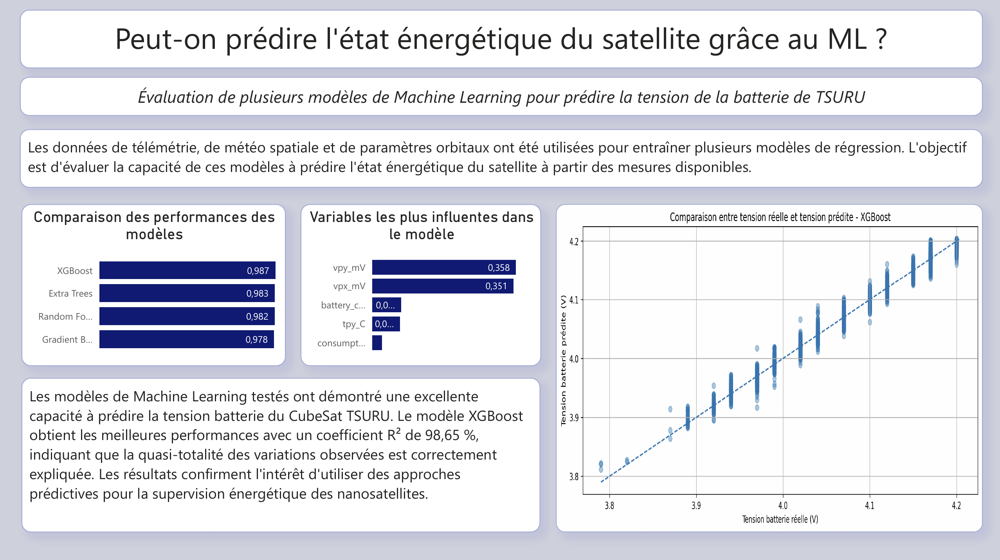

<p align="center">
  
</p>

# 🚀 E.C.L.I.P.S.E.

## Energy Consumption & Load Intelligence Platform for Space Exploration

A complete Business Intelligence and Machine Learning project focused on analyzing and predicting the energy behavior of the TSURU CubeSat using real telemetry, orbital and space weather data.

---

## 🛰️ Project Overview

TSURU is a CubeSat deployed from the International Space Station (ISS) as part of the BIRDS program.

This project investigates how a nanosatellite manages its energy resources while operating in Low Earth Orbit by combining telemetry data, space weather indicators and orbital parameters.

The project follows a complete BI workflow, from data collection and storage to dashboard development and predictive analytics.

---

## 🎯 Objectives

* Analyze the satellite energy system.
* Study the influence of space weather.
* Evaluate the impact of orbital altitude.
* Develop predictive Machine Learning models.
* Create an interactive Power BI dashboard.

---

## 📊 Dataset

* 23,266 telemetry measurements
* 302 days of mission data
* EPS (Electrical Power System) telemetry
* NOAA and NASA space weather indicators
* ISS orbital parameters

---

## 🏗️ BI Architecture

```text
API Collection
      ↓
Python Processing
      ↓
SQL Server Data Warehouse
      ↓
Power BI Dashboard
      ↓
Machine Learning Models
```

---

## 🗄️ Dimensional Model

<p align="center">
  
</p>

The data warehouse follows a dimensional modeling approach based on fact and dimension tables stored in SQL Server.

---

## 📈 Dashboard Preview

### 1. Mission Context



### 2. Energy Analysis



### 3. Space Weather Monitoring



### 4. Space Weather Impact



### 5. Orbital Altitude Analysis



### 6. Machine Learning



---

## 🤖 Machine Learning

Several regression models were evaluated:

* Random Forest
* Gradient Boosting
* Extra Trees
* XGBoost

### Best Performing Model

| Metric | Value   |
| ------ | ------- |
| R²     | 98.65 % |
| MAE    | 0.0071  |
| RMSE   | 0.0098  |

The XGBoost model achieved the highest predictive performance and accurately reproduced the battery voltage behavior observed during the mission.

---

## 🔍 Key Findings

✅ Solar panels provide sufficient energy to maintain satellite operations.

✅ Space weather had limited influence during the analyzed period.

✅ Orbital altitude variations had no significant impact on battery voltage.

✅ Machine Learning successfully predicted the satellite energy state with high accuracy.

---

## 🛠️ Technologies Used

### Data Engineering

* Python
* Pandas
* NumPy

### Database

* SQL Server

### Business Intelligence

* Power BI

### Machine Learning

* Scikit-Learn
* XGBoost

### Version Control

* GitHub

---

## 📂 Repository Structure

```text
dashboard/      Power BI dashboard screenshots
images/         Banner and dimensional model
notebooks/      Data preparation and Machine Learning notebooks
presentation/   Final presentation
sql/            SQL scripts and data warehouse creation
```

---

## 🔭 Future Improvements

* Integrate additional CubeSats from the BIRDS program.
* Analyze stronger geomagnetic storm events.
* Develop energy forecasting models several hours ahead.
* Extend the platform to additional satellite missions.

---

## 👩‍💻 Author

**Sabrina Gharbi**

Business Intelligence Consultant Training – Technifutur

2026
